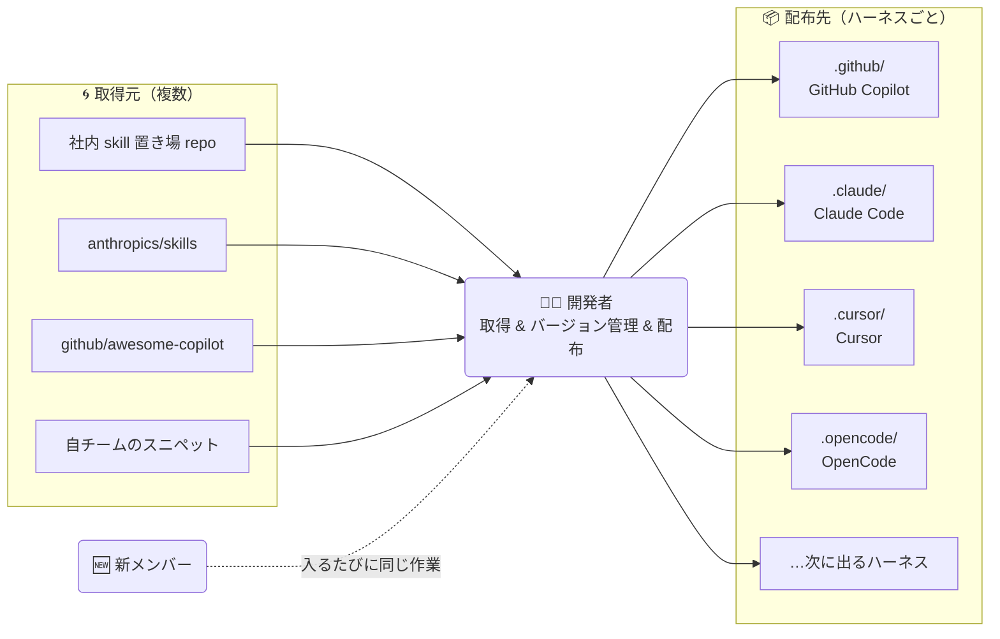
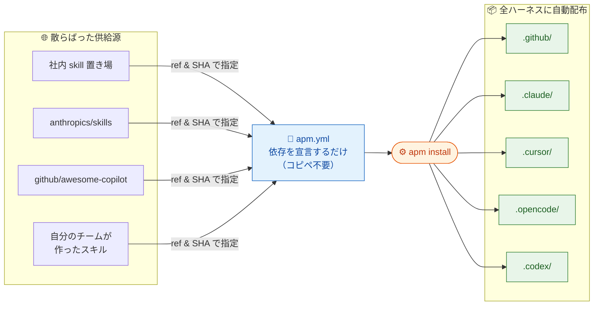
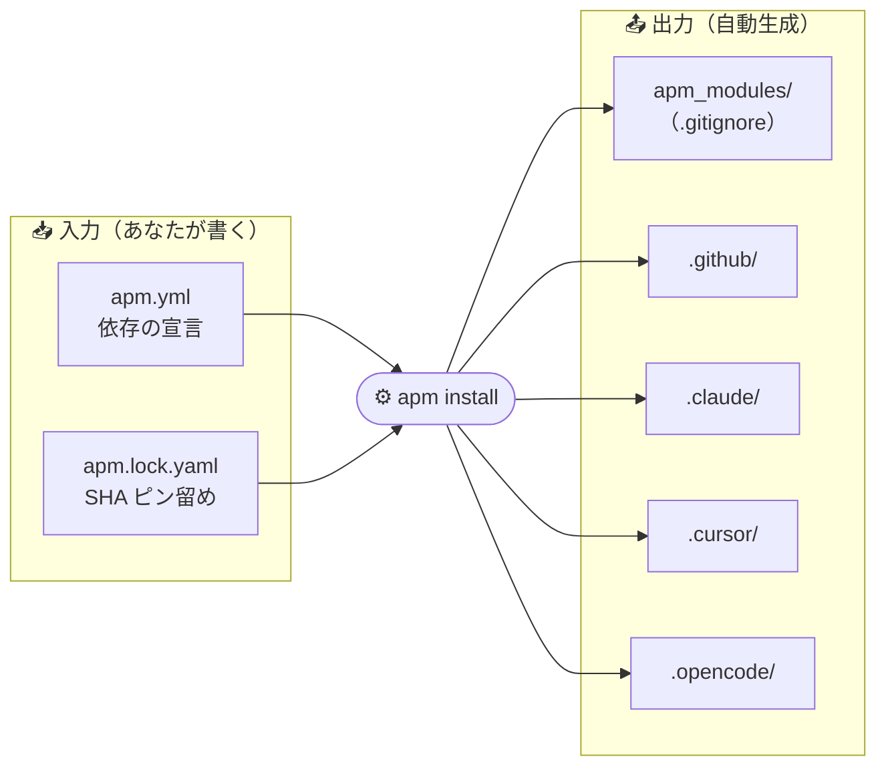
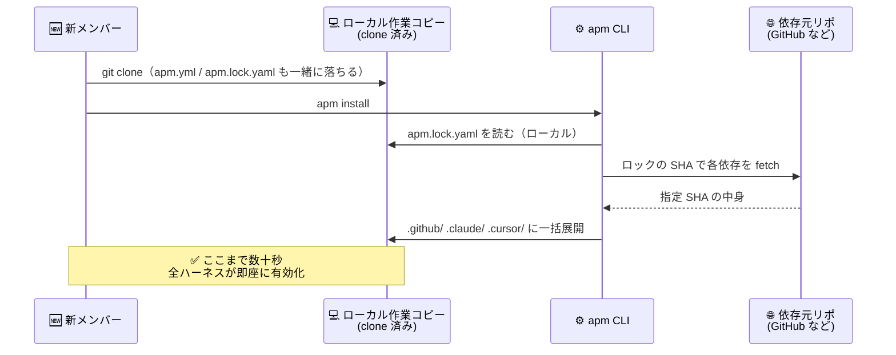

## はじめに

最近、AI エージェント（GitHub Copilot / Claude Code / Cursor / OpenCode / Codex …）に渡す「指示書」の種類が一気に増えました。

- GitHub Copilot → `.github/instructions/*.md`, `.github/prompts/*.md`
- Claude Code → `.claude/commands/*.md`, `.claude/agents/*.md`
- Cursor → `.cursor/rules/*.mdc`
- これに加えて MCP サーバー / hooks / skills …

チーム内でこれらを **「どこから集めて、どこに配っていますか？」**

:::message
もちろん [`anthropics/skills`](https://github.com/anthropics/skills) や [`github/awesome-copilot`](https://github.com/github/awesome-copilot) のような良質なカタログには、専用の取り込み UI や CLI が用意されていて、ゼロから手で書くより遥かに楽に取り込めるようになってきています。それでも、**集約と配布の運用を自分たちで組む必要がある**というペインは残ります。

- **集め先が分かれている**: 社内の Agent Skill 置き場リポ、Anthropic の skills、GitHub Awesome Copilot、自チームのスニペット…と、取得元が複数に分かれる
- **配り先もハーネスごとに分かれる**: 取ってきたものを Copilot / Claude / Cursor / OpenCode それぞれの置き場に反映する必要がある
  :::

絵にすると、**複数の取得元 × 複数のハーネス** という多対多の配線を、各チーム／各リポが自前で組んでいるイメージです。



個々のツールが便利になっても、**チーム全体としてこの配線を維持・再現する部分** には次のような課題が残りがちです。

- **取得元ごとに運用が分かれる**: それぞれに別のコマンド／別のバージョン指定／別の更新タイミングが存在
- **「社内リポにコピーして溜める」運用は二重保持になりやすい**: 便利な反面、元が進化したとき社内コピーとの差分管理が手間
- **ガイド文書ベースの配布はバージョン追跡が難しい**: 「この skill を入れてください」と書いても、誰がどのバージョンを取り込んだかは残りにくい
- **ハーネスが増えると配布先も増える**: 同じ内容を複数箇所に反映する運用を、ハーネス追加のたびに更新
- **新メンバーの onboarding が都度作業**: 「このカタログからこれを、あのリポからこれを…」の案内が毎回必要

この問題に真正面から取り組んでいるのが、今回紹介する **Agent Package Manager (APM)** です。

本記事は単なる公式ドキュメントの要約ではなく、実際に [`apm-handson-org/apm-handson`](https://github.com/apm-handson-org/apm-handson) というハンズオン用リポジトリを用意し、そこに対して `apm install` や `apm audit` を GitHub Actions で動かした結果を引用しながら進めます。読み終わったら自分の手元でそのまま再現できます。

## APM とは

[microsoft/apm](https://github.com/microsoft/apm) の README にはこう書かれています。

> **An open-source, community-driven dependency manager for AI agents.**

ひとことで言えば、**AI エージェント設定のための `package.json`** です。



コピペ元の「二重保持」も、コピペ先の「ハーネスごとに配る手間」も、どちらも `apm.yml` 1 枚に集約されます。特徴はこれだけ覚えればだいたい OK:

- `apm.yml` に依存を宣言
- `apm install` で全ハーネス（Copilot / Claude / Cursor / …）に一括展開
- `apm.lock.yaml` でコミット SHA までピン留めし、再現性を保証
- Microsoft org 配下の **MIT ライセンス OSS**（作者: [@danielmeppiel](https://github.com/danielmeppiel)）

### `apm.yml` のイメージ

```yaml
name: my-project
version: 1.0.0
dependencies:
    apm:
        - anthropics/skills/skills/frontend-design
        - github/awesome-copilot/plugins/context-engineering
        - microsoft/apm-sample-package#v1.0.0 # version pin
        - git: https://gitlab.com/acme/standards.git
          path: instructions/security
          ref: v2.0
    mcp:
        - io.github.github/github-mcp-server
```

GitHub / GitLab / Bitbucket / Azure DevOps / ローカルパス、なんでも依存先に指定できます。

## 仕組み: `apm install` で何が起こる？

プロジェクトに `apm.yml` を置いて `apm install` を実行すると、次のような構成になります。

入出力のフローを先に見ておくとイメージしやすいです。



生成物のツリーは次の通りです。

```
my-project/
├── apm.yml             ← 宣言（commit 対象）
├── apm.lock.yaml       ← 各依存のコミット SHA をピン留め（commit 対象）
├── apm_modules/        ← node_modules 相当（.gitignore）
├── .github/            ← Copilot が読む
├── .claude/            ← Claude Code が読む（runtime 設定時）
├── .cursor/            ← Cursor が読む（runtime 設定時）
└── .opencode/          ← OpenCode が読む（runtime 設定時）
```

ポイント:

- **1 回のインストールで全ハーネスに配置** される
- ローカル `.apm/` を置いておくと、依存より優先される（_local wins_）
- `apm_modules/` は `.gitignore` に入れ、展開済みの `.github/` などはコミット推奨（clone 直後の github.com 上の Copilot にも効かせるため）

:::message
APM v0.8 系では、デフォルトでは `.github/` にのみ配置されます。他ハーネス向けの展開は `apm runtime setup claude` / `cursor` / `opencode` 等で明示的に有効化します。
:::

## 何が嬉しいの？ — 開発者目線での 3 つの勝ち筋

仕組みは分かったので、実際の開発チームでどう効くのかを 3 つのシナリオで見ていきます。

### 勝ち筋 1: 新メンバーの onboarding が **1 コマンド** で終わる

チームに新しいメンバーが入ってきたとき、従来は「Copilot 用のルールはここに置いて、Claude 用はここ、Cursor 用は…」と口頭 or Wiki で案内していたはずです。APM があればこうなります。



口頭案内も Wiki 更新も不要。**`README` に `apm install` と書いておくだけで済む** のがとても楽です。

### 勝ち筋 2: ルール更新が **チーム全員に伝搬する**

「コーディング規約 v1.1 を出したので Copilot に反映してください」みたいなアナウンスをしたことがある方は多いと思います。APM だと以下のようになります。

| 従来運用の一例                                         | APM                                                   |
| ------------------------------------------------------ | ----------------------------------------------------- |
| Slack 等で「最新版が出たので取り直してください」と告知 | `apm.yml` の ref を `v1.1` にバンプして PR            |
| 反映タイミングはメンバーごとに多少ずれる               | **マージ後、全員が `git pull && apm install` で揃う** |
| 誰が取り込んだかは追いづらい                           | `apm.lock.yaml` の diff がレビューに現れる            |

ルールの配布が **Git の歴史に乗る** のが本質的な勝ち筋です。「誰が・いつ・どのバージョンを反映したか」が追えるようになります。

### 勝ち筋 3: ハーネス追加に **強い**

APM を導入した時点では Copilot しか使っていなくても、半年後にチームの誰かが「Claude Code 試したい」と言い出すかもしれません。そのとき:

- 従来: 過去に書いた Copilot 向けルールを Claude 用にコピー & 変換
- APM: `apm runtime setup claude` を 1 回叩くだけで、**過去に書いた全ルールがそのまま効く**

ハーネスは今後も増えていくことが予想されるので、**ルールをハーネス非依存な形で 1 箇所に書ける** のは長期的にかなり効いてきます。

---

ここまでの「嬉しさ」を実際に手を動かして体験するのが次のハンズオンです。その前に、APM を触る上でどうしても押さえておくべき **セキュリティ上の前提** を先に見ておきます。

## セキュリティモデル: 「File presence IS execution」

APM のセキュリティ設計を理解するには、**npm との違い**を見るのが早いです。

|     | install 後に必要な操作         | 実行タイミング         |
| --- | ------------------------------ | ---------------------- |
| npm | `require()` + `node app.js`    | 開発者が走らせたとき   |
| APM | **なし**（install = 使うこと） | **次のチャットで自動** |

配置された瞬間にエディタが watch し、次の LLM 呼び出しでシステム指示として取り込まれます。これが公式フレーズの **"File presence IS execution."** です。

言い換えると、**`apm install` = 即ハーネスで実行** なので、「何を入れるか」は npm 以上に慎重にならざるを得ません。APM はこの前提の上で、次の 4 段構えの対策を用意しています。

| 対策                                      | 一言で                                                                                     |
| ----------------------------------------- | ------------------------------------------------------------------------------------------ |
| **① コミットハッシュ（40 桁）でピン留め** | 中央 registry を使わず Git 直参照。短縮 SHA は拒否。                                       |
| **② 不可視 Unicode スキャン**             | プロンプトに紛れた隠し文字（Tag chars 等）を検出してブロック。Glassworm 攻撃の主経路を塞ぐ |
| **③ `apm-policy.yml`**                    | 会社ルールを **CI** で強制（ハンズオン②で実物を見せます）                                  |
| **④ ランタイム常駐なし / テレメトリなし** | `apm install` が終われば APM は消える                                                      |

:::message
**Glassworm (2026)**: 目に見えない Unicode（Tag characters など）で LLM にだけ届く隠し指示をプロンプトに埋め込む、実在の攻撃手法。APM `install` は配置前にこれを自動ブロックします。
:::

③ の `apm-policy.yml` については、配置場所や書き方・ローカルでは効かない仕様などまとまった説明が必要なので、これはハンズオン② の冒頭でまとめて扱います。

## ハンズオン ①: `apm install` を実際に動かす

ここから実機で動かしていきます。

:::message

### 📌 このハンズオンリポについて

以降で出てくる [`apm-handson-org/apm-handson`](https://github.com/apm-handson-org/apm-handson) は、**完成形のリファレンス** として公開しているものです。`apm.yml` / `apm.lock.yaml` / CI workflow / policy ファイル等を実際に動かした状態で置いてあるので、コードや設定の参照先として使ってください。

追体験のレベルはハンズオン①と②で少し違います。

| ハンズオン                       | clone だけで追体験できる？       | 自前の環境が必要？                                                            |
| -------------------------------- | -------------------------------- | ----------------------------------------------------------------------------- |
| **① `apm install`**              | ✅ できる（依存元は全て public） | 不要（ただし自分で `apm.yml` を書く経験を積みたいなら後述の **Step 0** 推奨） |
| **② `apm audit` を CI で動かす** | ⚠️ 結果の閲覧のみ                | **必要**。`apm-policy.yml` を置く org と、Actions を回すリポが要る            |

特にハンズオン②は `--policy org` が **リポジトリの owner 直下にある `.github` リポ** を見にいく仕様なので、自分の org（個人アカウントでも OK ですが Organization が無難）に置かないと実験になりません。後述の通り所要 org は 1 つで足ります。
:::

### Step 0.（任意）自分の org とハンズオンリポを用意する

ハンズオン②まで通しで体験したい場合、以下のセットアップを先にしておくと楽です（①だけなら不要）。

1. GitHub で **新規 Organization** を 1 つ作る（Free プランで OK）。
    - 名前は何でも OK です。例: `yourname-apm-handson` など。
    - :::message
      GitHub の **org 名はグローバルユニーク** なので、この記事の `apm-handson-org` と同じ名前は使えません。ただし **repo 名は org 内ユニーク** なので、下の 2 つは **そのままの名前で作って大丈夫** です。
      :::
2. その org 内に **空のリポジトリ 2 つ** を作る（名前は記事と同じで OK）:
    - `<your-org>/apm-handson` … この記事で `apm install` していくリポ
    - `<your-org>/.github` … 後の Step でポリシーファイルを置くリポ（**リポ名に `.github` というドットから始まる名前を使うのがポイント**）
3. ローカルで `apm-handson` を clone し、以降の Step は **このリポの中で** 作業します。

**org 名を記事のどこかに手入力する必要はほぼありません**。理由:

- `apm install` の対象は `microsoft/...` や `github/...` など **公開パッケージ側の owner** なので、あなたの org 名は出てきません
- `apm audit --ci --policy org` は **git remote から owner を自動解決** するので、あなたの org 名をコマンドに書く必要がありません
- 記事中に出てくる `apm-handson-org/...` は **私が公開しているリファレンス実装へのリンク** です（コピペせずリンクを開いて中身を確認する用途）

### Step 1. APM CLI をインストール

```bash
# macOS / Linux
curl -sSL https://aka.ms/apm-unix | sh

# Windows (PowerShell)
irm https://aka.ms/apm-windows | iex
```

確認:

```bash
apm --version
# Agent Package Manager (APM) CLI version 0.8.11 (81082e2)
```

### Step 2. プロジェクトを初期化

Step 0 を実施したかどうかで最初のコマンドが変わります。

**Step 0 を実施した場合**（`<your-org>/apm-handson` を clone 済み）:

```bash
cd apm-handson
apm init --yes
```

**Step 0 をスキップして① だけ試す場合**（ローカルにフォルダを作るだけ）:

```bash
mkdir apm-handson && cd apm-handson
apm init --yes
```

生成される `apm.yml`:

```yaml
name: apm-handson
version: 1.0.0
description: APM project for apm-handson
author: <your-github-username> # 実行環境の GitHub ユーザー名が自動で入る
dependencies:
    apm: []
    mcp: []
scripts: {}
```

### Step 3. 依存を 1 つ入れてみる

本記事では、LT スライドでも紹介されていた **`github/awesome-copilot` の `context-engineering` プラグイン** を入れていきます。

まず、いちばん素直な書き方 — **ref を指定せずに install** — を試します。

```bash
apm install github/awesome-copilot/plugins/context-engineering
```

`apm install` はこのとき以下のことを自動でやってくれます。

- 対象リポのデフォルトブランチの **最新コミット SHA を解決**
- それを **40 桁フル SHA で `apm.lock.yaml` にピン留め**
- 次回以降 `apm install` すると、ロックの SHA 通りに再現インストール

つまり **普段は SHA を自分で調べる必要はありません**。「何を install したか」は lockfile に自動で残ります。

一方で、本番運用や再現性をさらに厳しく担保したいとき（または特定コミットに固定したいとき）は、`#` の後にフル SHA を明示的に渡すこともできます。

```bash
# 例) 明示的にフル SHA を指定したい場合
SHA=$(gh api repos/github/awesome-copilot/commits/main --jq '.sha')
apm install "github/awesome-copilot/plugins/context-engineering#$SHA"
```

:::message
`#` の後ろに渡せるのはフル SHA 以外に **タグ・ブランチ名** も OK です。ただし APM は **短縮 SHA は拒否** します（タグ差し替えや branch 再書き換えによる汚染を避けるため、lockfile には常にフル SHA が入ります）。
:::

実行結果（抜粋、いずれの書き方でも同じ構造になります）:

```text
[+] github/awesome-copilot/plugins/context-engineering#63d08d51...
[*] Updated apm.yml with 1 new package(s)
[>] Installing 1 new package...
  [+] github.com/github/awesome-copilot/plugins/context-engineering#63d08d51... (cached)
  |-- 1 agents integrated -> .github/agents/
  |-- 3 skill(s) integrated -> .github/skills/

[*] Installed 1 APM dependency.
```

ツリーを見ると、`.github/` 以下に agent と skill が配置されていることが分かります。

```bash
$ find .github -type f | sort
.github/agents/context-architect.agent.md
.github/skills/context-map/SKILL.md
.github/skills/refactor-plan/SKILL.md
.github/skills/what-context-needed/SKILL.md
```

### Step 4. 再現性を体感する ＝ 新メンバーの初日を再現する

ここまでの成果物（`apm.yml`, `apm.lock.yaml`, `.github/`）をコミットしたうえで、**チームに新メンバーが入ってきた状況** をシミュレーションしてみます。生成物をいったん全削除して `apm install` すると、ロックファイル通りに復元されます。

```bash
# 「新メンバーがまだ何も持っていない」状態を作る
rm -rf apm_modules .github

# 新メンバーが README を読んでこのコマンドを叩く想定
apm install
```

`.github/` や `apm_modules/` が数秒で復元されるはずです。これがそのまま、

```
git clone <repo>
apm install     # ← これで終わり。Copilot / Claude / Cursor 全部に効く
```

という新メンバー向けのオンボーディング手順になります。`README` に `apm install` と一行書くだけで、**チーム共通のエージェント設定が即座に揃う** のが APM の体験価値です。

:::message alert
**コミット SHA は必ずフル 40 桁で**。APM は短縮 SHA を拒否します。汚染経路（タグ差し替え / branch 再書き換え）を塞ぐための仕様です。
:::

---

ハンズオン①はここまでです。便利さを体感できたところで、次は同じリポを使って、会社ルールを CI で強制する側（`apm audit`）を動かしていきます。`apm install` では触れなかった **`apm-policy.yml`** が主役になります。

## ハンズオン ②: `apm audit` を GitHub Actions で動かす

:::message alert
**ここから先は自分の org / repo が必要です。** [ハンズオン①](#ハンズオン-①-apm-install-を実際に動かす) 冒頭の **Step 0** で作った `<your-org>` 相当の環境で進めてください。[`apm-handson-org/apm-handson`](https://github.com/apm-handson-org/apm-handson) を clone しただけでは policy の差し替えや Actions 実行は行えません（結果ページの閲覧は可能）。
:::

### Step 0. `apm-policy.yml` とは — ハンズオン② の基礎知識

手を動かす前に、主役となる **`apm-policy.yml`** が何者なのかを押さえます。長くはないので軽く通読してください。

#### 何を書くファイル？

**「組織として、どのパッケージなら使ってよいか／ダメか」を宣言する YAML** です。依存先の allow / deny、MCP サーバーのトランスポート制限、必須パッケージの指定など、会社ルールを書き下せます。イメージはこう:

```yaml
dependencies:
    allow:
        - "microsoft/**"
        - "your-org/**"
    deny:
        - "untrusted-org/**"
        - "*/evil-*/**"
```

#### どこに置く？

置き場所は 3 レベルあります。

| レベル                  | 場所                           | 参照のされ方                                                                         |
| ----------------------- | ------------------------------ | ------------------------------------------------------------------------------------ |
| **Org**                 | `<org>/.github/apm-policy.yml` | `apm audit --ci --policy org` で自動検出（もっとも一般的）                           |
| **Repo**                | 各リポの `apm-policy.yml`      | `extends: org` で親を継承しつつ、そのリポだけ追加で厳しくしたい時に使う              |
| **Enterprise / 他 org** | 任意のリポに配置               | 子側の `extends: owner/repo` で参照。Enterprise 共通ポリシーを横断適用したい時に便利 |

継承順は **Enterprise → Org → Repo** で、子は親より厳しくしかできません（緩めることはできない）。たとえば Org で `deny: ["untrusted-org/**"]` を敷いた上で、Repo 側が追加で `deny: ["legacy-org/**"]` を足す、といった運用です。

:::message
CLI の `--policy` には **ローカルファイルパス** や **URL**、クロス org の `owner/repo` も指定可能です。本記事では一番典型的な `--policy org`（= `<org>/.github/apm-policy.yml`）を使います。
:::

#### ⚠️ ローカル `apm install` は `apm-policy.yml` を**見ない**

ここが APM の思想でかなり重要なポイントです。せっかくポリシーを書いても、ローカルの `apm install` はそれを**一切参照しません**。

```bash
# <org>/.github/apm-policy.yml で untrusted-org/** を deny していても…
apm install untrusted-org/evil-skill    # ← ローカルでは通ってしまう 😱
```

- `apm install` の自動ブロックは **不可視 Unicode のみ**
- `apm-policy.yml` は **`apm audit --ci --policy org` 専用**
- 思想: _「ローカルは自由、会社ルールは PR/CI で強制」_

というわけで、ポリシー強制はほぼ確実に **PR ベース + GitHub Actions** とセットで運用することになります。この章ではまさにそれを組んでいきます。

### 全体像

```text
[開発者ローカル]                    [CI / Pull Request]
 apm install                         apm audit --ci --policy org
     │                                   │
 不可視 Unicode 自動ブロック          6 baseline + 16 policy = 22 checks
     ▼                                   ▼
 .github/ 等に配置                    違反 → exit 1 → PR マージ不可
```

図中の「6 baseline + 16 policy = 22 checks」は、`apm audit` が実行する検査項目の内訳です。
**baseline** は `--ci` だけで必ず走る整合性チェック（lockfile の破損・不可視 Unicode など）、**policy** は `--policy` を付けた時だけ走る `apm-policy.yml` に紐づくルール群です。

項目が多いのでトグルに畳んでおきます。興味がある方はどうぞ。

:::details baseline checks（6 項目・`--ci` のみで実行）

| チェック                 | 内容                                                        |
| ------------------------ | ----------------------------------------------------------- |
| `lockfile-exists`        | `apm.yml` に依存があるなら `apm.lock.yaml` が存在すること   |
| `ref-consistency`        | `apm.yml` の ref と lockfile の resolved ref が一致すること |
| `deployed-files-present` | lockfile に記録された展開済みファイルが実在すること         |
| `no-orphaned-packages`   | lockfile にあるのに `apm.yml` から消えている依存がないこと  |
| `config-consistency`     | MCP サーバー設定が lockfile と一致すること                  |
| `content-integrity`      | 展開済みファイルに危険な不可視 Unicode が混入していないこと |

出典: [Policy Reference – Baseline checks](https://microsoft.github.io/apm/enterprise/policy-reference/#baseline-checks-always-run-with---ci)

:::

:::details policy checks（16 項目・`--policy` 付きで追加実行）

**Dependencies（依存関係ガバナンス, 6）**

| チェック                     | 内容                                                           |
| ---------------------------- | -------------------------------------------------------------- |
| `dependency-allowlist`       | 全ての依存が allow パターンにマッチする                        |
| `dependency-denylist`        | deny パターンにマッチする依存がない                            |
| `required-packages`          | `require` で指定した必須パッケージが `apm.yml` にある          |
| `required-packages-deployed` | 必須パッケージが lockfile に載って実際に展開されている         |
| `required-package-version`   | バージョンピン付き必須パッケージが `require_resolution` に従う |
| `transitive-depth`           | 依存の深さが `max_depth` を超えない                            |

**MCP（MCP サーバーの許可制御, 4）**

| チェック           | 内容                                                             |
| ------------------ | ---------------------------------------------------------------- |
| `mcp-allowlist`    | MCP サーバー名が allow にマッチ                                  |
| `mcp-denylist`     | deny にマッチする MCP がない                                     |
| `mcp-transport`    | トランスポート (`stdio` / `streamable-http` 等) がポリシーに従う |
| `mcp-self-defined` | リポジトリ固有 MCP がポリシーの可否に従う                        |

**Compilation（コンパイル先の統制, 3）**

| チェック               | 内容                                                        |
| ---------------------- | ----------------------------------------------------------- |
| `compilation-target`   | ターゲット（vscode / claude / cursor など）がポリシーに従う |
| `compilation-strategy` | `distributed` / `single-file` の戦略が一致                  |
| `source-attribution`   | 出典情報の埋め込み要件を満たす                              |

**Manifest（`apm.yml` そのものの健全性, 2）**

| チェック                   | 内容                                                       |
| -------------------------- | ---------------------------------------------------------- |
| `required-manifest-fields` | `version` / `description` など必須フィールドが埋まっている |
| `scripts-policy`           | `scripts` セクションがポリシー上許容されているか           |

**Unmanaged files（管理外ファイルの検知, 1）**

| チェック          | 内容                                                                        |
| ----------------- | --------------------------------------------------------------------------- |
| `unmanaged-files` | `.github/agents/` などガバナンス対象ディレクトリに APM 管理外ファイルがない |

出典: [Policy Reference – Policy checks](https://microsoft.github.io/apm/enterprise/policy-reference/#policy-checks-run-with---ci---policy)

:::

本記事で動かすのは、このうち `dependency-denylist` を使うパターンです。

### Step 1. `<org>/.github/apm-policy.yml` を置く

Step 0 で押さえた通り、`apm audit --ci --policy org` は **`<your-org>/.github` リポジトリの `apm-policy.yml`** を自動参照します。具体的な手順に落とすと以下です（[Step 0（任意）](#step-0.（任意）自分の-org-とハンズオンリポを用意する) で `<your-org>/.github` リポを作成済みである前提）。

1. ローカルに `<your-org>/.github` を clone する

    ```bash
    git clone git@github.com:<your-org>/.github.git
    cd .github
    touch apm-policy.yml
    ```

2. リポのルートに `apm-policy.yml` を作る（本記事では以下の内容を使用）

    ```yaml:apm-policy.yml
    name: "apm-handson-org Policy"
    enforcement: block # block | warn | off

    dependencies:
        # Deny any dependency whose repo name begins with "evil-".
        deny:
            - "*/evil-*/**"

    mcp:
        self_defined: warn
        transport:
            allow: [stdio, streamable-http]
    ```

3. commit & push（デフォルトブランチに入っていれば OK、PR 経由でも可）

    ```bash
    git add apm-policy.yml
    git commit -m "chore: add apm-policy.yml"
    git push origin main
    ```

4. ブラウザで `https://github.com/<your-org>/.github/blob/main/apm-policy.yml` を開き、**raw で閲覧できる**ことを確認する

リファレンス実装はこちらです。

https://github.com/apm-handson-org/.github/blob/main/apm-policy.yml

:::message
**glob の書き方に注意**。`*/evil-*` だと `owner/evil-repo` の 2 セグメントしか拾わず、`owner/evil-repo/skills/hello` のようにサブパス指定で install された依存を取りこぼします。`/**` サフィックスをつけて `*/evil-*/**` にしておくと、サブパス依存もまとめてブロックできます。
:::

### Step 2. ハンズオンリポ側の Actions を書く

ここからは Step 0 で作った `<your-org>/apm-handson` 側の作業です（すでにローカルに clone 済みの想定）。手順は以下です。

1. リポに新しいブランチを切る（main 直 push でも動きますが、PR 経由の動作を確認したいので推奨）

    ```bash
    cd apm-handson
    git switch -c ci/apm-audit
    ```

2. `.github/workflows/apm-audit.yml` を新規作成し、次の内容を保存する

    ```bash
    mkdir -p .github/workflows
    touch .github/workflows/apm-audit.yml
    ```

    ```yaml:.github/workflows/apm-audit.yml
    name: APM Policy Compliance

    on:
        pull_request:
            paths:
                - "apm.yml"
                - "apm.lock.yaml"
                - ".github/**"
        push:
            branches: [main]
            paths:
                - "apm.yml"
                - "apm.lock.yaml"
                - ".github/**"

    permissions:
        contents: read
        security-events: write # upload-sarif に必要

    jobs:
        apm-audit:
            runs-on: ubuntu-latest
            steps:
                - uses: actions/checkout@v4

                - name: Install APM CLI
                  run: curl -fsSL https://raw.githubusercontent.com/microsoft/apm/main/install.sh | bash

                - name: Baseline checks (lockfile + hidden Unicode)
                  run: apm audit --ci

                - name: Policy checks (<your-org>/.github/apm-policy.yml)
                  run: apm audit --ci --policy org --no-cache -f sarif -o policy-report.sarif
                  env:
                      GITHUB_TOKEN: ${{ secrets.GITHUB_TOKEN }}

                - name: Upload SARIF to Code Scanning
                  if: always()
                  uses: github/codeql-action/upload-sarif@v3
                  with:
                      sarif_file: policy-report.sarif
                      category: apm-policy
    ```

3. commit & push して PR を立て、マージする（初回はマージ後に main で走って Code Scanning の UI が初期化されます）

    ```bash
    git add .github/workflows/apm-audit.yml
    git commit -m "ci: add apm audit workflow"
    git push origin ci/apm-audit

    # そのまま gh CLI で PR 作成 & マージ
    gh pr create --fill --base main
    gh pr merge --squash --delete-branch
    ```

4. `https://github.com/<your-org>/apm-handson/actions` を開き、`APM Policy Compliance` が緑 ✅ で通っていることを確認

リファレンス実装の workflow はこちらです。

https://github.com/apm-handson-org/apm-handson/blob/main/.github/workflows/apm-audit.yml

ポイント:

- **Baseline と Policy を別ステップに**。Baseline（lockfile 整合性・不可視 Unicode）は `apm-policy.yml` がなくても効く基礎チェック。
- `--policy org` で GitHub API から org の `apm-policy.yml` を自動取得（`GITHUB_TOKEN` が必要）
- `-f sarif` で出力すると、`github/codeql-action/upload-sarif@v3` で **GitHub Code Scanning** にそのまま載せられる
- `if: always()` をつけておくと、audit が落ちても SARIF はアップロードされる

### Step 3. 違反 PR で落ちる様子を見る

テスト用に `ry0y4n/evil-sample-skill` という **無害なデモ用リポジトリ**（`*/evil-*/**` deny ルールにあえて引っかかる命名）を作り、それをハンズオンリポに install した PR を立てます。

https://github.com/apm-handson-org/apm-handson/pull/2

PR トップ画面。`apm-audit` が ❌ で PR マージがブロックされているのが分かります。


Actions の実行ログを開くと、`Policy checks` ステップが **exit code 1** で失敗していることが確認できます。


ログ自体には `CI audit report written to policy-report.sarif` としか出ていない点に注目してください。本記事の workflow では `-f sarif -o policy-report.sarif` でファイル出力しているため、**違反の具体内容（どの依存がどのパターンで deny されたか）はコンソールには流れず、SARIF ファイルにだけ書き込まれます。**

その SARIF が Code Scanning にアップロードされるので、Security タブ（または PR 画面の check annotation）から詳細をアラートとして確認できます。ここで初めて `ry0y4n/evil-sample-skill/skills/hello` が `*/evil-*/**` の deny パターンにヒットした、という情報が見える形です。


:::message
CI ログでも直接違反内容を見たい場合は、Policy checks のステップを 2 つに分けて「表形式で stdout 出力する用」と「SARIF を書き出す用」を別々に走らせるのが実用的です（例: 先に `apm audit --ci --policy org` → 失敗時でも `if: always()` で `-f sarif -o ...` を実行）。
:::

手元で同じ状態を再現したい場合は、違反パッケージを install した状態でブランチに切り替えて、次のコマンドを叩いてください。

```bash
# ハンズオンリポを clone し、違反 PR のブランチに切り替える
git clone https://github.com/apm-handson-org/apm-handson.git
cd apm-handson
git switch feat/demo-policy-violation

# GITHUB_TOKEN は `--policy org` が <org>/.github を GitHub API から取得するのに使う
# gh CLI が入っていれば `gh auth token` でそのまま渡せる
GITHUB_TOKEN=$(gh auth token) apm audit --ci --policy org --no-cache
```

`-f text`（既定）なので、SARIF に入るのと同じ違反情報がそのまま表形式でコンソールに表示されます。

```text
                              [>] APM Policy Compliance
┏━━━━━━━━━━┳━━━━━━━━━━━━━━━━━━━━━━━━┳━━━━━━━━━━━━━━━━━━━━━━━━━━━━━━━━━━━━━━━━━━━━━━━━┓
┃ Status   ┃ Check                  ┃ Message                                        ┃
┡━━━━━━━━━━╇━━━━━━━━━━━━━━━━━━━━━━━━╇━━━━━━━━━━━━━━━━━━━━━━━━━━━━━━━━━━━━━━━━━━━━━━━━┩
│ [+]      │ lockfile-exists        │ Lockfile present                               │
│ [+]      │ ref-consistency        │ All dependency refs match lockfile             │
│ [+]      │ deployed-files-present │ All deployed files present on disk             │
│ [+]      │ no-orphaned-packages   │ No orphaned packages in lockfile               │
│ [+]      │ config-consistency     │ No MCP configs to check                        │
│ [+]      │ content-integrity      │ No critical hidden Unicode characters detected │
│ [+]      │ dependency-allowlist   │ No dependency allow list configured            │
│          │ dependency-denylist    │ 1 dependency(ies) match deny list              │
└──────────┴────────────────────────┴────────────────────────────────────────────────┘

  dependency-denylist details:
    - ry0y4n/evil-sample-skill/skills/hello: denied by pattern: */evil-*/**

[x] 1 of 8 check(s) failed
```

期待通りブロックできました 🛡️

## 運用 Tips

### Required status check にする

PR を通すルートで必ず `apm-audit` を通すには、**Repository settings → Rules → Rulesets** で `apm-audit` を Required status check にしておきます。これをやらないと、違反 PR でも人が気合で merge ボタンを押せてしまいます。

### main 直 push 運用ならどうする？

ワークフローを `on: push` にも設定しておくと、main が汚染された場合に後追いでアラートを出せます（防げはしないけど検知はできる）。より厳しくしたいなら pre-commit hook や社内 git proxy（Artifactory 等）で git ホスト側を遮断する方向になります。

### 継承

`apm-policy.yml` は **Enterprise → Org → Repo** の順で継承され、子は親より厳しくしかできません。Enterprise で敷いた最低ラインを Org や Repo で緩められないのは運用上嬉しい性質です。

## まとめ

- **APM = AI エージェント設定の `package.json`**。`apm init` → 依存追加 → `apm install` の 3 ステップで全ハーネスに配布できる。
- セキュリティは **二段構え**:
    - ローカル `apm install` = 不可視 Unicode 自動ブロック **のみ**
    - CI `apm audit --ci --policy org` = 会社ルール（allow / deny / require）を強制
- **`apm-policy.yml` + GitHub Actions + Rulesets** の組み合わせを前提にして、PR をゲート化するのが運用の王道。
- まだ _early days_ なプロジェクトなので、glob の挙動など細かいところで「あれ？」となる場面もあります。そういうときこそ [microsoft/apm](https://github.com/microsoft/apm) に Issue を立てる or PR を送るチャンスかもしれません。

## ハンズオン資産

この記事で使ったものは全部公開しています。Clone してそのままなぞれます。

- ハンズオンリポ: https://github.com/apm-handson-org/apm-handson
- org policy (dummy org): https://github.com/apm-handson-org/.github
- デモ用違反パッケージ: https://github.com/ry0y4n/evil-sample-skill

## 参考リンク

- GitHub: https://github.com/microsoft/apm
- Docs: https://microsoft.github.io/apm/
- Quick Start: https://microsoft.github.io/apm/getting-started/quick-start/
- CLI Reference: https://microsoft.github.io/apm/reference/cli-commands/
- Security: https://microsoft.github.io/apm/enterprise/security/
- CI Policy Setup: https://microsoft.github.io/apm/guides/ci-policy-setup/
- Policy Reference: https://microsoft.github.io/apm/enterprise/policy-reference/
