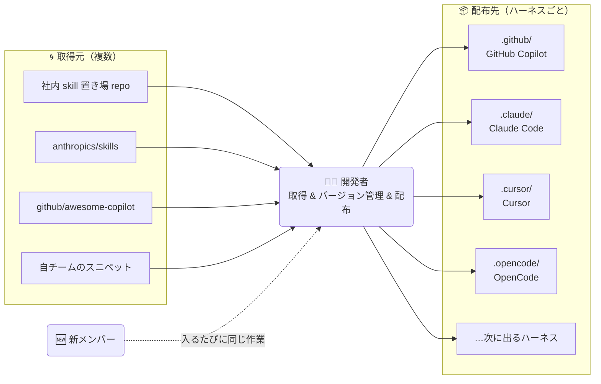
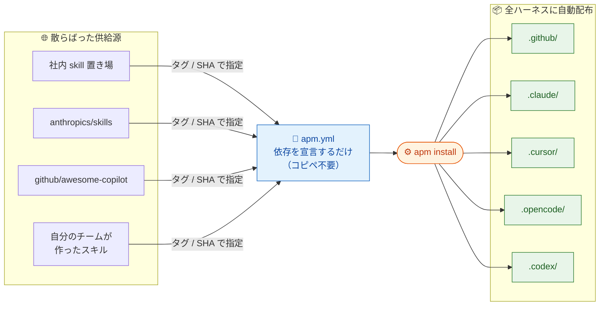
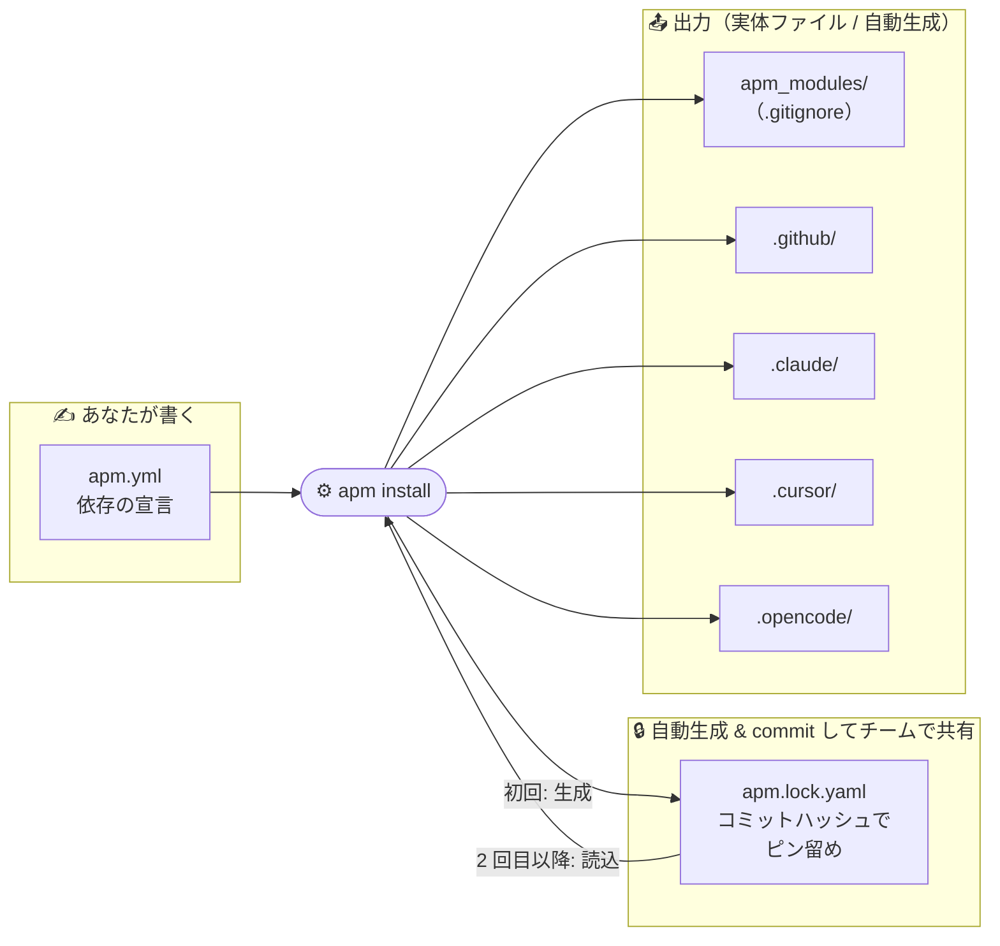
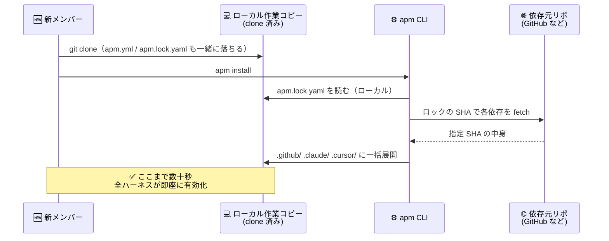
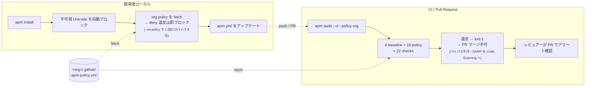

## はじめに

最近、AI エージェント（GitHub Copilot / Claude Code / Cursor / OpenCode / Codex …）に渡す「指示書」の種類が一気に増えました。

- GitHub Copilot → `.github/instructions/*.md`, `.github/prompts/*.md`
- Claude Code → `.claude/commands/*.md`, `.claude/agents/*.md`
- Cursor → `.cursor/rules/*.mdc`
- これに加えて MCP サーバー / hooks / skills …

チーム内でこれらを **「どこから集めて、どこに配っていますか？」**

:::message
[`anthropics/skills`](https://github.com/anthropics/skills) や [`github/awesome-copilot`](https://github.com/github/awesome-copilot) のような良質なカタログには、専用の取り込み UI や CLI が用意されていて、ゼロから手で書くより遥かに楽に取り込めるようになってきています。それでも、**集約と配布の運用を自分たちで組む必要がある**というペインは残ります。

- **集め先が分かれている**: 社内の Agent Skill 置き場リポ、Anthropic の skills、GitHub Awesome Copilot、自チームのスニペット…と、取得元が複数に分かれる
- **配り先もハーネスごとに分かれる**: 取ってきたものを Copilot / Claude / Cursor / OpenCode それぞれの置き場に反映する必要がある
  :::

絵にすると、**複数の取得元 × 複数のハーネス** という多対多の配線を、各チーム／各リポが自前で組んでいるイメージです。



個々のツールが便利になっても、**チーム全体としてこの配線を維持・再現する部分** には次のような課題が残りがちです。

- **取得元ごとに運用が分かれる**: それぞれに別のコマンド／別のバージョン指定／別の更新タイミングが存在
- **「社内リポにコピーして溜める」運用は二重保持になりやすい**: 便利な反面、元が進化したとき社内コピーとの差分管理が手間
- **ガイド文書ベースの配布はバージョン追跡が難しい**: 「この skill を入れてください」と書いても、誰がどのバージョンを取り込んだかは残りにくい
- **ハーネスが増えると配布先も増える**: 同じ内容を複数箇所に反映する運用を、ハーネス追加のたびに更新
- **新メンバーの onboarding が都度作業**: 「このカタログからこれを、あのリポからこれを…」の案内が毎回必要

この問題に真正面から取り組んでいるのが、今回紹介する **Agent Package Manager (APM)** です。

## APM とは

[microsoft/apm](https://github.com/microsoft/apm) の README にはこう書かれています。

> **An open-source, community-driven dependency manager for AI agents.**

ひとことで言えば、**AI エージェント設定のための `package.json`** です。



コピペ元の「二重保持」も、コピペ先の「ハーネスごとに配る手間」も、どちらも `apm.yml` 1 枚に集約されます。特徴はこれだけ覚えればだいたい OK:

- `apm.yml` に依存を宣言
- `apm install` で全ハーネス（Copilot / Claude / Cursor / …）に一括展開
- `apm install` が `apm.lock.yaml` を自動生成し、コミットハッシュ（commit SHA）までピン留めして再現性を保証
- Microsoft org 配下の **MIT ライセンス OSS**

### `apm.yml` のイメージ

```yaml
name: my-project
version: 1.0.0
dependencies:
    apm:
        - anthropics/skills/skills/frontend-design
        - github/awesome-copilot/plugins/context-engineering
        - microsoft/apm-sample-package#v1.0.0 # version pin
        - git: https://gitlab.com/acme/standards.git
          path: instructions/security
          ref: v2.0
    mcp:
        - io.github.github/github-mcp-server
```

GitHub / GitLab / Bitbucket / Azure DevOps / ローカルパス、なんでも依存先に指定できます。

## 仕組み: `apm install` で何が起こる？

プロジェクトに `apm.yml` を置いて `apm install` を実行すると、次のような構成になります。

入出力のフローを先に見ておくとイメージしやすいです。



生成物のツリーは次の通りです。

```
my-project/
├── apm.yml             ← 宣言（commit 対象）
├── apm.lock.yaml       ← 各依存のコミットハッシュをピン留め（commit 対象）
├── apm_modules/        ← node_modules 相当（.gitignore）
├── .github/            ← Copilot が読む
├── .claude/            ← Claude Code が読む（runtime 設定時）
├── .cursor/            ← Cursor が読む（runtime 設定時）
└── .opencode/          ← OpenCode が読む（runtime 設定時）
```

ポイント:

- **1 回のインストールで全ハーネスに配置** される
- ローカル `.apm/` を置いておくと、依存より優先される（_local wins_）
- `apm_modules/` は `.gitignore` に入れ、展開済みの `.github/` などはコミット推奨（clone 直後の github.com 上の Copilot にも効かせるため）

:::message
デフォルトでは `.github/` にのみ配置されます。他ハーネス向けの展開は `apm runtime setup claude` / `cursor` / `opencode` 等で明示的に有効化します。
:::

## 何が嬉しいの？ — 開発者目線での 3 つの勝ち筋

仕組みは分かったので、実際の開発チームでどう効くのかを 3 つのシナリオで見ていきます。

### 勝ち筋 1: 新メンバーの onboarding が **1 コマンド** で終わる

チームに新しいメンバーが入ってきたとき、従来は「Copilot 用のルールはここに置いて、Claude 用はここ、Cursor 用は…」と口頭 or Wiki で案内していたはずです。APM があればこうなります。



口頭案内も Wiki 更新も不要。**`README` に `apm install` と書いておくだけで済む** のがとても楽です。

### 勝ち筋 2: ルール更新が **チーム全員に伝搬する**

「コーディング規約 v1.1 を出したので Copilot に反映してください」みたいなアナウンスをしたことがある方は多いと思います。APM だと以下のようになります。

| 従来運用の一例                                         | APM                                                         |
| ------------------------------------------------------ | ----------------------------------------------------------- |
| Slack 等で「最新版が出たので取り直してください」と告知 | `apm.yml` のバージョン指定（`#v1.1` の部分）をバンプして PR |
| 反映タイミングはメンバーごとに多少ずれる               | **マージ後、全員が `git pull && apm install` で揃う**       |
| 誰が取り込んだかは追いづらい                           | `apm.lock.yaml` の diff がレビューに現れる                  |

ルールの配布が **Git の歴史に乗る** のが本質的な勝ち筋です。「誰が・いつ・どのバージョンを反映したか」が追えるようになります。

### 勝ち筋 3: ハーネス追加に **強い**

APM を導入した時点では Copilot しか使っていなくても、半年後にチームの誰かが「Claude Code 試したい」と言い出すかもしれません。そのとき:

- 従来: 過去に書いた Copilot 向けルールを Claude 用にコピー & 変換
- APM: `apm runtime setup claude` を 1 回叩くだけで、**過去に書いた全ルールがそのまま効く**

ハーネスは今後も増えていくことが予想されるので、**ルールをハーネス非依存な形で 1 箇所に書ける** のは長期的にかなり効いてきます。

---

ここまでの「嬉しさ」を実際に手を動かして体験するのが次のハンズオンです。その前に、APM を触る上でどうしても押さえておくべき **セキュリティ上の前提** を先に見ておきます。

## セキュリティモデル: 「File presence IS execution」

APM のセキュリティ設計を理解するには、**npm との違い**を見るのが早いです。

|     | install 後に必要な操作         | 実行タイミング         |
| --- | ------------------------------ | ---------------------- |
| npm | `require()` + `node app.js`    | 開発者が走らせたとき   |
| APM | **なし**（install = 使うこと） | **次のチャットで自動** |

配置された瞬間にエディタが watch し、次の LLM 呼び出しでシステム指示として取り込まれます。これが公式フレーズの **"File presence IS execution."** です。

言い換えると、**`apm install` = 即ハーネスで実行** なので、「何を入れるか」は npm 以上に慎重にならざるを得ません。APM はこの前提の上で、次の 4 段構えの対策を用意しています。

| 対策                                               | 一言で                                                                                                                                     |
| -------------------------------------------------- | ------------------------------------------------------------------------------------------------------------------------------------------ |
| **A. lockfile に 40 桁コミットハッシュを焼き付け** | 中央 registry を介さず Git から直接 fetch。`apm.lock.yaml` に常に 40 桁フル SHA が記録されるので、タグや branch 指定でも再現性が担保される |
| **B. 不可視 Unicode スキャン**                     | プロンプトに紛れた隠し文字（Tag chars 等）を検出してブロック。Glassworm 攻撃の主経路を塞ぐ                                                 |
| **C. `apm-policy.yml`**                            | 会社ルールを **ローカル `apm install` と CI `apm audit` の両方で強制**（ハンズオン②で実物を見せます）                                      |
| **D. ランタイム常駐なし / テレメトリなし**         | `apm install` が終われば APM は消える                                                                                                      |

:::message
**Glassworm (2026)**: 目に見えない Unicode（Tag characters など）で LLM にだけ届く隠し指示をプロンプトに埋め込む、実在の攻撃手法。APM `install` は配置前にこれを自動ブロックします。
:::

C. の `apm-policy.yml` については、配置場所や書き方・ローカル/CI それぞれでの効き方などまとまった説明が必要なので、これはハンズオン② の冒頭でまとめて扱います。

## ハンズオンの全体像

これから 2 本立てのハンズオンで、APM の「**調達**」と「**ガバナンス**」の両面を体験します。

| ハンズオン                           | テーマ                           | やること                                                                                                                                                                                                                                         | 役割イメージ |
| ------------------------------------ | -------------------------------- | ------------------------------------------------------------------------------------------------------------------------------------------------------------------------------------------------------------------------------------------------ | ------------ |
| **① `apm install`**                  | **再現性のある「調達」**         | 公開されている agent / skill パッケージを `apm install` で取り込み、`apm.yml` / `apm.lock.yaml` に **40 桁のコミットハッシュでピン留め** されることを確認する。新メンバー初日の再現セットアップも体感する。                                      | 利用者として |
| **② `apm-policy.yml` + `apm audit`** | **組織ルールでの「ガバナンス」** | org 共通の `apm-policy.yml` を `<org>/.github` リポに配置し、**ローカル `apm install` と CI `apm audit --ci --policy org` の両方で deny ルールを強制** する。違反 PR が GitHub Actions で止まり、Code Scanning に SARIF が上がるところまで通す。 | 管理者として |

①でパッケージマネージャとしての基本動作を押さえ、②でそれを「組織として安全に運用する」ためのガードレールを敷く、という流れです。次の Step 0 でまず両ハンズオン共通の足場（org ＋ 2 リポ）を作ります。

## ハンズオン ①: `apm install` を実際に動かす

ここから実機で動かしていきます。

### Step 0. 自分の org とハンズオンリポを用意する

ハンズオン①〜② を通しで体験するため、以下のセットアップを最初に済ませておきます。

1. GitHub で **新規 Organization** を 1 つ作る（Free プランで OK）。
    - 名前は何でも OK です。例: `yourname-apm-handson` など。
2. その org 内に **空のリポジトリ 2 つ** を作る（名前は記事と同じで OK）:
    - **`<your-org>/apm-handson`** … この記事で `apm install` していくリポ
    - **`<your-org>/.github`** … 後の Step でポリシーファイルを置くリポ（**リポ名は `.github` 固定**。`apm audit --policy org` は `<org>/.github/apm-policy.yml` を読みに行く仕様なので、他の名前にはできません）

    :::message alert
    **`apm-handson` と `.github` の両方を public で作成してください**。
    - `apm-handson`: ハンズオン② で `apm audit` の SARIF を **GitHub Code Scanning** にアップロードしますが、Code Scanning は public リポなら無料、private リポでは GitHub Advanced Security (有料) が必要です。
    - `.github`: CI 上の `apm audit --ci --policy org` は実行リポ側の `GITHUB_TOKEN` で `.github` リポの `apm-policy.yml` を取得します。`.github` が private だと別リポのトークンでは読めず、**警告 1 行 (`[!] Policy fetch failed: HTTP 401 …`) は出るもののデフォルト fail-open で pass してしまい**、違反検出のデモが成立しません（`apm.yml` で `policy.fetch_failure_default: block` を設定すれば fail-closed にできますが、本ハンズオンでは public 化で進めます）。

    :::

3. ローカルで `apm-handson` を clone し、以降の Step は **このリポの中で** 作業します。

    ```bash
    git clone https://github.com/<your-org>/apm-handson.git
    ```

### Step 1. APM CLI をインストール

```bash
# macOS / Linux
curl -sSL https://aka.ms/apm-unix | sh

# Windows (PowerShell)
irm https://aka.ms/apm-windows | iex
```

確認:

```bash
apm --version
# Agent Package Manager (APM) CLI version 0.9.1 (1b7d2f08)
```

### Step 2. プロジェクトを初期化

`<your-org>/apm-handson` を clone したディレクトリで初期化します。

```bash
cd apm-handson
apm init --yes
```

生成される `apm.yml`:

```yaml
name: apm-handson
version: 1.0.0
description: APM project for apm-handson
author: <your-github-username> # 実行環境の GitHub ユーザー名が自動で入る
dependencies:
    apm: []
    mcp: []
scripts: {}
```

### Step 3. 依存を 1 つ入れてみる

本記事では例として **[`github/awesome-copilot`](https://github.com/github/awesome-copilot) の [`context-engineering` プラグイン](https://github.com/github/awesome-copilot/tree/main/plugins/context-engineering)** を入れていきます。

まず、いちばん素直な書き方を試します。

```bash
apm install github/awesome-copilot/plugins/context-engineering
```

`apm install` はこのとき以下のことを自動でやってくれます。

- 対象リポのデフォルトブランチの **最新コミットハッシュを解決**
- それを **40 桁フル SHA で `apm.lock.yaml` にピン留め**
- 次回以降 `apm install` すると、ロックの SHA 通りに再現インストール

一方で、本番運用や再現性をさらに厳しく担保したいとき（または特定コミットに固定したいとき）は、`#` の後にフル SHA を明示的に渡すこともできます。

```bash
# 例) 明示的にフル SHA を指定したい場合
SHA=$(gh api repos/github/awesome-copilot/commits/main --jq '.sha')
apm install "github/awesome-copilot/plugins/context-engineering#$SHA"
```

:::message
`#` の後ろに渡せるのはフル SHA 以外に **タグ・ブランチ名・短縮 SHA（7 文字以上）** も OK です。どの形で指定しても、APM は `apm.lock.yaml` の `resolved_commit` に **常に 40 桁のフル SHA を記録** する仕様（[Lock File Specification §4.2](https://microsoft.github.io/apm/reference/lockfile-spec/#42-dependency-entries) で `resolved_commit` は MUST「Full 40-character commit SHA」と規定）なので、タグ差し替えや branch 再書き換えがあっても、ピン留めされた瞬間のコミットが再現されます。
:::

実行結果（抜粋、いずれの書き方でも同じ構造になります）:

```bash
[*] Validating 1 package...
[+] github/awesome-copilot/plugins/context-engineering
[*] Updated apm.yml with 1 new package(s)
[>] Installing 1 new package...
  [+] github.com/github/awesome-copilot/plugins/context-engineering (cached)
  |-- 1 agents integrated -> .github/agents/
  |-- 3 skill(s) integrated -> .github/skills/
[i] Added apm_modules/ to .gitignore

-- Diagnostics --
  [i] 1 dependency has no pinned version -- pin with #tag or #sha to prevent drift

[*] Installed 1 APM dependency.
```

ツリーを見ると、`.github/` 以下に agent と skill が配置されていることが分かります。

```bash
$ find .github -type f | sort
.github/agents/context-architect.agent.md
.github/skills/context-map/SKILL.md
.github/skills/refactor-plan/SKILL.md
.github/skills/what-context-needed/SKILL.md
```

### Step 4. 再現性を体感する ＝ 新メンバーの初日を再現する

まずはここまでの成果物（`apm.yml`, `apm.lock.yaml`, `.gitignore`, `.github/`）をリモートに push しておきます。次のハンズオン②で CI から `apm.yml` / `apm.lock.yaml` を読むため、ここで main に上げておかないと workflow だけ push しても audit が空振りします。

```bash
git add apm.yml apm.lock.yaml .gitignore .github/
git commit -m "chore: apm install (context-engineering)"
git push origin main
```

そのうえで、**チームに新メンバーが入ってきた状況** をシミュレーションしてみます。生成物（`apm_modules/` と `apm install` で展開された `.github/agents/` `.github/skills/`）をいったん全削除して `apm install` すると、ロックファイル通りに復元されます。

```bash
# 「新メンバーがまだ何も持っていない」状態を作る
rm -rf apm_modules .github/agents .github/skills

# 新メンバーが README を読んでこのコマンドを叩く想定
apm install
```

`.github/` や `apm_modules/` が数秒で復元されるはずです。これがそのまま、

```bash
git clone <repo>
apm install     # ← これで終わり。Copilot / Claude / Cursor 全部に効く
```

という新メンバー向けのオンボーディング手順になります。`README` に `apm install` と一行書くだけで、**チーム共通のエージェント設定が即座に揃う** のが APM の体験価値です。

---

ハンズオン①はここまでです。便利さを体感できたところで、次は同じリポを使って、会社ルールを CI で強制する側（`apm audit`）を動かしていきます。`apm install` では触れなかった **`apm-policy.yml`** が主役になります。

## ハンズオン ②: `apm audit` を GitHub Actions で動かす

### Step 0. `apm-policy.yml` とは — ハンズオン② の基礎知識

手を動かす前に、主役となる **`apm-policy.yml`** が何者なのかを押さえます。長くはないので軽く通読してください。

#### 何を書くファイル？

**「組織として、どのパッケージなら使ってよいか／ダメか」を宣言する YAML** です。依存先の allow / deny、MCP サーバーのトランスポート制限、必須パッケージの指定など、会社ルールを書き下せます。イメージはこう:

```yaml
dependencies:
    allow:
        - "microsoft/**"
        - "your-org/**"
    deny:
        - "untrusted-org/**"
        - "*/evil-*/**"
```

#### どこに置く？

置き場所は 3 レベルあります。

| レベル                  | 場所                           | 参照のされ方                                                                         |
| ----------------------- | ------------------------------ | ------------------------------------------------------------------------------------ |
| **Org**                 | `<org>/.github/apm-policy.yml` | `apm audit --ci --policy org` で自動検出（もっとも一般的）                           |
| **Repo**                | 各リポの `apm-policy.yml`      | `extends: org` で親を継承しつつ、そのリポだけ追加で厳しくしたい時に使う              |
| **Enterprise / 他 org** | 任意のリポに配置               | 子側の `extends: owner/repo` で参照。Enterprise 共通ポリシーを横断適用したい時に便利 |

継承順は **Enterprise → Org → Repo** で、子は親より厳しくしかできません（緩めることはできない）。たとえば Org で `deny: ["untrusted-org/**"]` を敷いた上で、Repo 側が追加で `deny: ["legacy-org/**"]` を足す、といった運用です。

:::message
CLI の `--policy` には **ローカルファイルパス** や **URL**、クロス org の `owner/repo` も指定可能です。本記事では一番典型的な `--policy org`（= `<org>/.github/apm-policy.yml`）を使います。
:::

#### ✅ ローカル `apm install` も `apm-policy.yml` を見る（v0.9〜）

APM v0.9 系から、`apm install` は実行時に **org の `apm-policy.yml` を自動 fetch して deny 違反をローカルでブロック** するようになりました。「install してから push して CI で初めて気づく」というラグが消え、手元でその場で止まります。

```bash
# <org>/.github/apm-policy.yml で */evil-*/** を deny していると…
apm install ry0y4n/evil-sample-skill/skills/hello
# →
# [!] Policy: org:<org>/.github -- enforcement=block
# [x] Policy violation: dependency-denylist -- 1 dependency(ies) match deny list:
#       ry0y4n/evil-sample-skill/skills/hello: denied by pattern: */evil-*/**
# [i] apm.yml restored to its previous state.
# [x] Install blocked by org policy -- ... use `--no-policy` for one-off bypass
```

:::message
2 回目以降の install では `[!] Policy: org:<org>/.github (cached, fetched 1m ago) -- enforcement=block` のように、キャッシュ参照表記が付きます。違反時は `[i] apm.yml restored to its previous state.` の通り **`apm.yml` が自動ロールバック** されるため、手元が汚染されないのも嬉しいポイントです。
:::

意図的に試したいときや一時的にバイパスしたいときは `--no-policy` を付けます（CI まで素通りすることはありません）。

```bash
apm install ry0y4n/evil-sample-skill/skills/hello --no-policy
# [!] Policy enforcement disabled by --no-policy for this invocation.
#     This does NOT bypass apm audit --ci. CI will still fail the PR for
#     the same policy violation.
```

#### 📌 ポリシー取得失敗時は **デフォルト fail-open**

ネットワーク不調や `<org>/.github` リポジトリが private で読めない場合など、policy が取得できなかった時は警告を出した上で **そのまま pass** します（fail-open）。

```text
[!] Policy fetch failed: HTTP 401 fetching policy from <org>/.github;
    proceeding without policy checks
    (set policy.fetch_failure_default=block in apm.yml to fail closed)
```

セキュアな組織で「取れなかったら止める (fail-closed)」にしたい場合は `apm.yml` に次の 1 行を入れます。

```yaml
policy:
    fetch_failure_default: block
```

このフラグを入れた状態で取得が失敗すると、warning ではなく error として落ちます:

```text
[x] Policy fetch failed: HTTP 401 fetching policy from <org>/.github
    (policy.fetch_failure_default=block)
```

これで取得失敗時には install / audit ともに exit 1 で止まるようになります。後述のハンズオン②では fail-open のまま進めますが、本番運用ではこのスイッチを入れるかどうかを最初に決めておくのがおすすめです。

### 全体像



ローカルでも CI でも同じ `apm-policy.yml` を見るので、**ルールは 1 か所、適用は 2 段** という defense in depth になっています。CI 側は `--no-policy` を許容しないので、ローカルでバイパスされた PR もここで必ず止まります。

図中の「6 baseline + 16 policy = 22 checks」は、`apm audit` が実行する検査項目の内訳です。
**baseline** は `--ci` だけで必ず走る整合性チェック（lockfile の破損・不可視 Unicode など）、**policy** は `--policy` を付けた時だけ走る `apm-policy.yml` に紐づくルール群です。

項目が多いのでトグルに畳んでおきます。興味がある方はどうぞ。

:::details baseline checks（6 項目・`--ci` のみで実行）

| チェック                 | 内容                                                        |
| ------------------------ | ----------------------------------------------------------- |
| `lockfile-exists`        | `apm.yml` に依存があるなら `apm.lock.yaml` が存在すること   |
| `ref-consistency`        | `apm.yml` の ref と lockfile の resolved ref が一致すること |
| `deployed-files-present` | lockfile に記録された展開済みファイルが実在すること         |
| `no-orphaned-packages`   | lockfile にあるのに `apm.yml` から消えている依存がないこと  |
| `config-consistency`     | MCP サーバー設定が lockfile と一致すること                  |
| `content-integrity`      | 展開済みファイルに危険な不可視 Unicode が混入していないこと |

出典: [Policy Reference – Baseline checks](https://microsoft.github.io/apm/enterprise/policy-reference/#baseline-checks-always-run-with---ci)

:::

:::details policy checks（16 項目・`--policy` 付きで追加実行）

**Dependencies（依存関係ガバナンス, 6）**

| チェック                     | 内容                                                           |
| ---------------------------- | -------------------------------------------------------------- |
| `dependency-allowlist`       | 全ての依存が allow パターンにマッチする                        |
| `dependency-denylist`        | deny パターンにマッチする依存がない                            |
| `required-packages`          | `require` で指定した必須パッケージが `apm.yml` にある          |
| `required-packages-deployed` | 必須パッケージが lockfile に載って実際に展開されている         |
| `required-package-version`   | バージョンピン付き必須パッケージが `require_resolution` に従う |
| `transitive-depth`           | 依存の深さが `max_depth` を超えない                            |

**MCP（MCP サーバーの許可制御, 4）**

| チェック           | 内容                                                             |
| ------------------ | ---------------------------------------------------------------- |
| `mcp-allowlist`    | MCP サーバー名が allow にマッチ                                  |
| `mcp-denylist`     | deny にマッチする MCP がない                                     |
| `mcp-transport`    | トランスポート (`stdio` / `streamable-http` 等) がポリシーに従う |
| `mcp-self-defined` | リポジトリ固有 MCP がポリシーの可否に従う                        |

**Compilation（コンパイル先の統制, 3）**

| チェック               | 内容                                                        |
| ---------------------- | ----------------------------------------------------------- |
| `compilation-target`   | ターゲット（vscode / claude / cursor など）がポリシーに従う |
| `compilation-strategy` | `distributed` / `single-file` の戦略が一致                  |
| `source-attribution`   | 出典情報の埋め込み要件を満たす                              |

**Manifest（`apm.yml` そのものの健全性, 2）**

| チェック                   | 内容                                                       |
| -------------------------- | ---------------------------------------------------------- |
| `required-manifest-fields` | `version` / `description` など必須フィールドが埋まっている |
| `scripts-policy`           | `scripts` セクションがポリシー上許容されているか           |

**Unmanaged files（管理外ファイルの検知, 1）**

| チェック          | 内容                                                                        |
| ----------------- | --------------------------------------------------------------------------- |
| `unmanaged-files` | `.github/agents/` などガバナンス対象ディレクトリに APM 管理外ファイルがない |

出典: [Policy Reference – Policy checks](https://microsoft.github.io/apm/enterprise/policy-reference/#policy-checks-run-with---ci---policy)

:::

本記事で動かすのは、このうち `dependency-denylist` を使うパターンです。

### Step 1. `<org>/.github/apm-policy.yml` を置く

1. ローカルに `<your-org>/.github` を clone する

    ```bash
    git clone git@github.com:<your-org>/.github.git
    cd .github
    touch apm-policy.yml
    ```

2. リポのルートに `apm-policy.yml` を作る（本記事では以下の内容を使用）

    ```yaml:apm-policy.yml
    name: "apm-handson-org Policy"
    enforcement: block # block | warn | off

    dependencies:
        # Deny any dependency whose repo name begins with "evil-".
        deny:
            - "*/evil-*/**"

    mcp:
        self_defined: warn
        transport:
            allow: [stdio, streamable-http]
    ```

3. commit & push（デフォルトブランチに入っていれば OK、PR 経由でも可）

    ```bash
    git add apm-policy.yml
    git commit -m "chore: add apm-policy.yml"
    git push origin main
    ```

### Step 2. ハンズオンリポ側の Actions を書く

ここからは Step 0 で作った `<your-org>/apm-handson` 側の作業です。手順は以下です。

1.  リポに新しいブランチを切る（main 直 push でも動きますが、PR 経由の動作を確認したいので推奨）

    ```bash
    git switch -c ci/apm-audit
    ```

2.  `.github/workflows/apm-audit.yml` を新規作成し、次の内容を保存する

    ```bash
    mkdir -p .github/workflows
    touch .github/workflows/apm-audit.yml
    ```

    ```yaml:.github/workflows/apm-audit.yml
    name: APM Policy Compliance

    on:
        pull_request:
            paths:
                - "apm.yml"
                - "apm.lock.yaml"
                - ".github/**"
        push:
            branches: [main]
            paths:
                - "apm.yml"
                - "apm.lock.yaml"
                - ".github/**"

    permissions:
        contents: read
        security-events: write # upload-sarif に必要
        actions: read # upload-sarif が workflow run 情報を取得するのに必要

    jobs:
        apm-audit:
            runs-on: ubuntu-latest
            steps:
                - uses: actions/checkout@v4

                - name: Install APM CLI
                  run: curl -fsSL https://raw.githubusercontent.com/microsoft/apm/main/install.sh | bash

                - name: Baseline checks (lockfile + hidden Unicode)
                  run: apm audit --ci

                - name: Policy checks (<your-org>/.github/apm-policy.yml)
                  if: always() # Baseline が落ちても SARIF は必ず生成する
                  run: apm audit --ci --policy org --no-cache -f sarif -o policy-report.sarif
                  env:
                      GITHUB_TOKEN: ${{ secrets.GITHUB_TOKEN }}

                - name: Upload SARIF to Code Scanning
                  if: always()
                  uses: github/codeql-action/upload-sarif@v3
                  with:
                      sarif_file: policy-report.sarif
                      category: apm-policy
    ```

3.  commit & push して PR を立てる

    ```bash
    git add .github/workflows/apm-audit.yml
    git commit -m "ci: add apm audit workflow"

    git push -u origin ci/apm-audit

    # gh CLI で PR 作成
    gh pr create --fill --base main
    ```

4.  PR 画面で **`APM Policy Compliance` が緑 ✅** になることを確認する

    paths filter に `.github/**` を含めているので、この PR 自体に対して workflow が初回起動します。コマンドラインで待ちたい場合は以下が便利です。

    ```bash
    gh pr checks --watch   # 全チェックが完了するまで待つ
    ```

5.  ✅ を確認したらマージ → main に反映

    ```bash
    gh pr merge --squash --delete-branch
    ```

ポイント:

- **Baseline と Policy を別ステップに**: Baseline（lockfile 整合性・不可視 Unicode）は `apm-policy.yml` がなくても効く基礎チェック
- **`-f sarif` → Code Scanning**: `github/codeql-action/upload-sarif@v3` でそのまま **GitHub Code Scanning** に載る
- **`if: always()` を Policy / Upload SARIF の両方に**: Baseline 違反で workflow が止まると SARIF が未生成のまま Upload が `Path does not exist` で落ちるため。`always()` を付けておけば必ず Code Scanning に届く

### Step 3. 二段ゲート（ローカル + CI）で違反パッケージを止める

テスト用に `ry0y4n/evil-sample-skill` という **無害なデモ用リポジトリ**（`*/evil-*/**` deny ルールにあえて引っかかる命名）を用意しています。v0.9 系の APM では deny 違反が **二段で** 止まることを順番に体験していきます。

1. **ローカルでブロック**される (fast feedback)
2. それを **`--no-policy` で意図的にバイパス**して PR を作る
3. **CI が最終ゲート** として再びブロックする

リファレンスとなる違反 PR はこちらです（実際にチェックが赤になっている状態）。

https://github.com/apm-handson-org/apm-handson/pull/2

#### 手順

1. 違反パッケージ用のブランチを切る

    ```bash
    git switch -c feat/demo-policy-violation
    ```

2. **まずは普通に install を試す → ローカルで弾かれる**

    ```bash
    apm install ry0y4n/evil-sample-skill/skills/hello
    ```

    出力（抜粋）:

    ```text
    [!] Policy: org:<your-org>/.github -- enforcement=block
    [x] Policy violation: dependency-denylist -- 1 dependency(ies) match deny list:
          ry0y4n/evil-sample-skill/skills/hello: denied by pattern: */evil-*/**
      Blocked by org policy at org:<your-org>/.github -- ... or use `--no-policy`
      for one-off bypass
    [i] apm.yml restored to its previous state.
    [x] Install blocked by org policy -- see violations above
    ```

    （2 回目以降の実行では先頭が `[!] Policy: org:<your-org>/.github (cached, fetched 1m ago) -- enforcement=block` のようにキャッシュ表記付きになります。）

    `apm.yml` は **元の状態に自動ロールバック** されているので、ここでやめれば何も汚染されません。これが v0.9 系のローカルゲートです。

3. **CI ゲートを試したいので `--no-policy` で意図的にバイパスして install**

    ```bash
    apm install ry0y4n/evil-sample-skill/skills/hello --no-policy
    ```

    出力（抜粋）:

    ```text
    [!] Policy enforcement disabled by --no-policy for this invocation.
        This does NOT bypass apm audit --ci. CI will still fail the PR
        for the same policy violation.
    ...
    [*] Installed 1 APM dependency.
    ```

    今度は通り、`apm.yml` / `apm.lock.yaml` / `.github/skills/hello/` に差分が出ます。CLI 自身が「CI は止めるよ」と注意してくれているのが親切ですね。

4. commit & push して PR を立てる

    ```bash
    git add apm.yml apm.lock.yaml .github/
    git commit -m "feat: install evil-sample-skill (demo violation)"
    git push -u origin feat/demo-policy-violation

    gh pr create --fill --base main
    ```

5. PR 画面で `apm-audit` が ❌ になり、マージがブロックされていることを確認する

    ```bash
    gh pr checks --watch
    ```

    

6. Actions の実行ログを開き、`Policy checks` ステップが **exit code 1** で失敗していることを確認する

    

    本記事の workflow では `-f sarif -o policy-report.sarif` でファイル出力しているため、**違反の具体内容（どの依存がどのパターンで deny されたか）はコンソールには流れず、SARIF ファイルにだけ書き込まれます。**

7. **PR 上で違反内容のアラートを確認する**

    その SARIF が Code Scanning にアップロードされ、PR スコープのアラートとして登録されます。**Security タブの Code scanning ページは既定で default branch (main) のみを表示する**ため、main にまだ違反が無いこの段階だと一覧には何も出ないように見えるかもしれません。PR 段階のアラートは次のいずれかで見ます:
    - **PR の "Checks" タブ** → `apm-audit` の "Details" を開くと、左ペインに Code scanning の結果が表示される
    - **Security and quality → Code scanning** ページでフィルタを **`pr:<番号>`** に切り替える

    ここで初めて `ry0y4n/evil-sample-skill/skills/hello` が `*/evil-*/**` の deny パターンにヒットした、という情報がアラートとして見える形です。

    

:::message
CI ログでも直接違反内容を見たい場合は、Policy checks のステップを 2 つに分けて「表形式で stdout 出力する用」と「SARIF を書き出す用」を別々に走らせるのが実用的です（例: 先に `apm audit --ci --policy org` → 失敗時でも `if: always()` で `-f sarif -o ...` を実行）。
:::

#### 確認後の後片付け

違反 PR は **マージせずに close** しておきましょう。

```bash
gh pr close 2 --delete-branch
```

#### （参考）手元で audit だけ再現する

「PR まで立てずに、ローカルで CI と同じ違反検出だけ見たい」場合は、リファレンス実装の違反ブランチを直接 audit にかけるのが早いです。

```bash
git switch feat/demo-policy-violation

GITHUB_TOKEN=$(gh auth token) apm audit --ci --policy org --no-cache
```

`-f text`（既定）なので、SARIF に入るのと同じ違反情報がそのまま表形式でコンソールに表示されます。

```text
                              [>] APM Policy Compliance
┏━━━━━━━━━━┳━━━━━━━━━━━━━━━━━━━━━━━━┳━━━━━━━━━━━━━━━━━━━━━━━━━━━━━━━━━━━━━━━━━━━━━━━━┓
┃ Status   ┃ Check                  ┃ Message                                        ┃
┡━━━━━━━━━━╇━━━━━━━━━━━━━━━━━━━━━━━━╇━━━━━━━━━━━━━━━━━━━━━━━━━━━━━━━━━━━━━━━━━━━━━━━━┩
│ [+]      │ lockfile-exists        │ Lockfile present                               │
│ [+]      │ ref-consistency        │ All dependency refs match lockfile             │
│ [+]      │ deployed-files-present │ All deployed files present on disk             │
│ [+]      │ no-orphaned-packages   │ No orphaned packages in lockfile               │
│ [+]      │ config-consistency     │ No MCP configs to check                        │
│ [+]      │ content-integrity      │ No critical hidden Unicode characters detected │
│ [+]      │ dependency-allowlist   │ No dependency allow list configured            │
│          │ dependency-denylist    │ 1 dependency(ies) match deny list              │
└──────────┴────────────────────────┴────────────────────────────────────────────────┘

  dependency-denylist details:
    - ry0y4n/evil-sample-skill/skills/hello: denied by pattern: */evil-*/**

[x] 1 of 8 check(s) failed
```

期待通りブロックできました。

## 運用 Tips

### CI が通らない PR をマージできなくする

PR を通すルートで必ず `apm-audit` を通すには、**Repository settings → Rules → Rulesets** で `apm-audit` を **Require status checks to pass** に追加しておきます。これをやらないと、違反 PR でも人が気合で merge ボタンを押せてしまいます。

### main 直 push 運用ならどうする？

ワークフローを `on: push` にも設定しておくと、main が汚染された場合に後追いでアラートを出せます（防げはしないけど検知はできる）。より厳しくしたいなら pre-commit hook や社内 git proxy（Artifactory 等）で git ホスト側を遮断する方向になります。

### ポリシー取得失敗時に fail-closed にする

デフォルトでは `apm install` / `apm audit` ともに、ネットワーク不調や `.github` リポへの権限不足で `apm-policy.yml` が取れなかった場合、警告 1 行 (`[!] Policy fetch failed: ...`) を出した上で **そのまま pass** します（fail-open）。「取れない時は止める」運用にしたい場合は `apm.yml` に次を追加します。

```yaml
policy:
    fetch_failure_default: block
```

これで取得失敗時には install / audit ともに exit 1 で停止します。CI で `<your-org>/.github` を private 運用したい場合や、ネットワーク分断時にも安全側に倒したい場合はこの設定を入れておきましょう。

### 継承

`apm-policy.yml` は **Enterprise → Org → Repo** の順で継承され、子は親より厳しくしかできません。Enterprise で敷いた最低ラインを Org や Repo で緩められないのは運用上嬉しい性質です。

## まとめ

- **APM は「AI エージェント設定の `package.json`」**。Copilot / Claude / Cursor など複数ハーネスへの配布、バージョン固定、再現性のあるセットアップを 1 つの `apm.yml` に集約する。
- **解決する課題**: ハーネスごとのコピペ運用、メンバー間の設定差、依存パッケージの素性不明 — それらすべてが Git の歴史に乗る。
- **再現性**: lockfile に 40 桁のコミットハッシュが焼き付くので、誰がいつ install しても同じ状態。新メンバーは `git clone && apm install` だけで完成形の環境が手に入る。
- **ガバナンスもできる**: `apm-policy.yml` で組織のルールを 1 か所に書けば、ローカルの install 時点と CI 上の監査の両方で違反を自動ブロックできる。PR レベルで違反を可視化できるので、組織として「何を取り込んでよいか」を統制できる。
- まだ early days なプロジェクトなので、ハマりどころに当たったら [microsoft/apm](https://github.com/microsoft/apm) に Issue / PR を投げて育てていくフェーズ。

## ハンズオン資産

この記事で使ったものは全部公開しています。Clone してそのままなぞれます。

- ハンズオンリポ（完成形・コピペ参考用）: https://github.com/apm-handson-org/apm-handson
- org policy リポ（完成形）: https://github.com/apm-handson-org/.github
- デモ用違反パッケージ: https://github.com/ry0y4n/evil-sample-skill

## 参考リンク

- GitHub: https://github.com/microsoft/apm
- Docs: https://microsoft.github.io/apm/
- Quick Start: https://microsoft.github.io/apm/getting-started/quick-start/
- CLI Reference: https://microsoft.github.io/apm/reference/cli-commands/
- Security: https://microsoft.github.io/apm/enterprise/security/
- CI Policy Setup: https://microsoft.github.io/apm/guides/ci-policy-setup/
- Policy Reference: https://microsoft.github.io/apm/enterprise/policy-reference/
